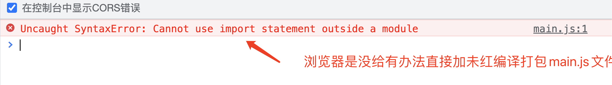
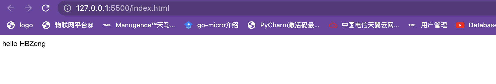

#### Bundler 是什么？

**诞生原因**

使用import export 这种同步加载的方式在大多数浏览器中无法使用。

#### Bundler - 打包工具

将浏览器不支持的模块进行编译，转换，合并最后生成的代码可以在浏览器端良好的

运行的工具。

#### 大家最熟悉的-Webpack

* 对于web应用来说：一般采用单Javascript文件入口
* https://webpack.js.org
* 举例时间

```
npx webpack main.js
```

下面我们演示一下，直接引用main.js

```html
<!doctype html>
<html>
  <head>
    <title>Getting Started</title>
  </head>
  <body>
     <div id="root"></div>
     <script src="./main.js"></script>
  </body>
</html>
```

#### main.js 入口文件代码如下：

```javascript
import { hello } from './hello'
document.getElementById('root').innerHTML = hello('HBZeng')
```

#### hello.js 模块文件

```javascript
export function hello(message) {
  return 'hello ' + message
}
export function foo(message() {
  return 'bar' + messae
})
```


我们不难发现大多浏览器是不支持ES module，此时我就需要借助一个打包工具对main.js进行编译转换
npx webpack ./main.js
执行上面打包后，会创建一个disk目录同命main.js

```javascript
(()=>{"use strict";document.getElementById("root").innerHTML="hello HBZeng"})();
```

修改index.html的js引用

```html
<script src="./dist/main.js"></script>
```



同样我们用rollup也可以进行打包编译

npx rollup main.js --file dist/bundle.js --format iife

我可以看了来打包bundle.js文件可读性很强了

```javascript
(function () {
  'use strict';

  function hello(message) {
    return 'hello ' + message
  }

  document.getElementById('root').innerHTML = hello('HBZeng');

})();

```

#### 后起之秀- Rollup

* https://rollupjs.org/guide/en
