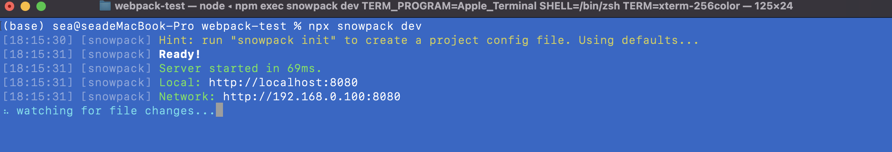
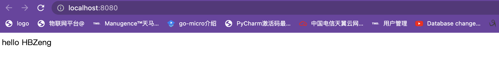
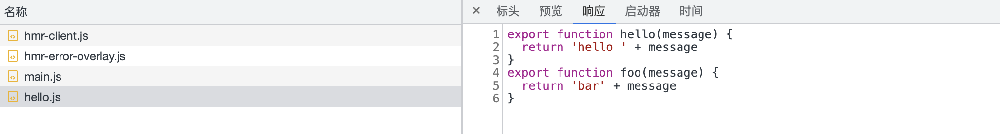

##### 另辟蹊径 - 简介 Snowpack

**Bundler 的问题**

* 当资源越来越多的时候，打包速度越来越慢。
* 大中型项目，启动时间可能达到好几分钟。

**另辟蹊径 - Snowpack**

* https://www.snowpack.dev
* 利用新版浏览器支持es modules的特性。
* 不会被打包。
* 每个文件编译一次，永久被缓存。
* 当一个文件修改的时候，只需要重build那一个文件。

  

  ### 安装snowpack来作一个测试


  ```html
  <!doctype html>
  <html>
    <head>
      <title>Getting Started</title>
    </head>
    <body>
       <div id="root"></div>
       <script src="./main.js" type="module"></script>
    </body>
  </html>
  ```

  直接运行

  ```bash
  npx snowpack dev
  ```







#### 处理Node_modules中模块

* 它扫描node_modules中模块。找到使用模块
* 将每个模块都分别转换成单个js文件。
* 这些单个文件都esm模块，可以被最新的浏览器直接使用。

### 为生产环节 Build 代码

**默认情况下，和开发环境生成的代码是几乎一致的。**

> **You should be able to use a bundler because you want to, and not because you need to**
>
> 当你想用一个 bundler 你可以自己选择去用，而不是你必须要用。

提供了插件，生成 bundle 以后全浏览器兼容的代码
