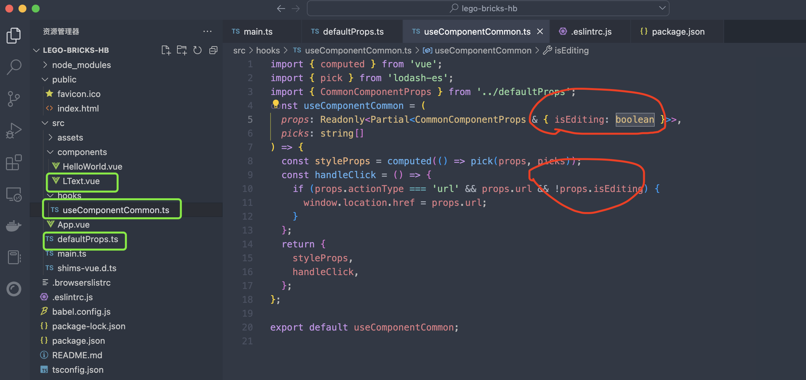

1. 创建一个目录，并进行项目初始化
   ```bash
   mkdir lego-bricks-hb
   cd lego-bricks-hb
   imooc-cli init
   ```


2.将之前在B端项目中的Ltext.vue 及 hooks 下面useComponentCommon.ts 及 defautlProps.ts 挪到新创建lego-bricks-hb项目中

文件结构如下：


