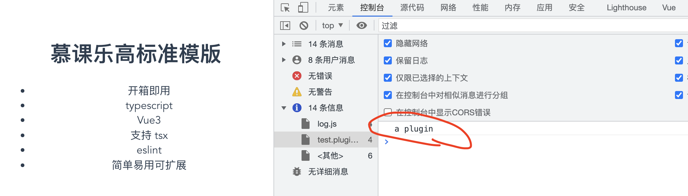
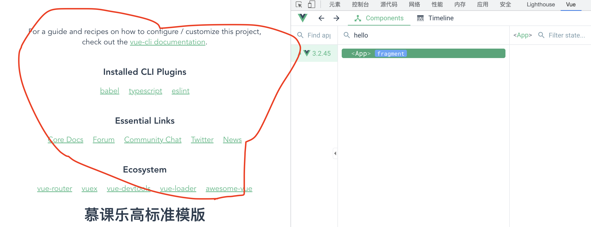
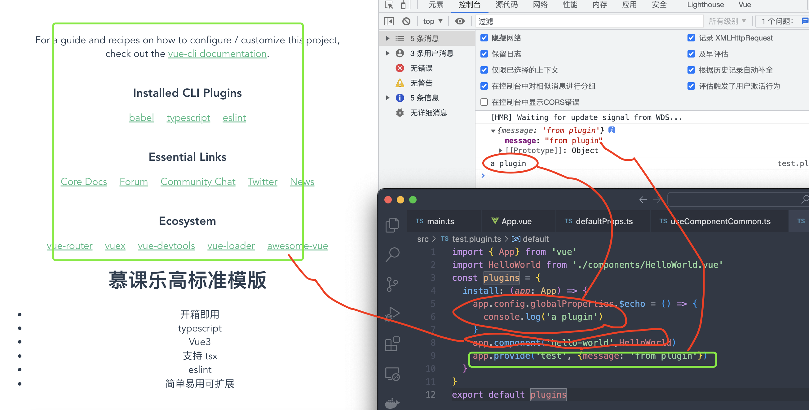

#### Vue3的插件系统

一段代码给vue应用实例添加全局功能。它的格式是一个object暴露了一个**install()**方法

或是一个**function**

它没有严格限制，一般有以下几种功能

* 添加全局方法或者属性
* 添加全局资源：指令，过滤器等
* 通过全局混入来添加一些组件选项
* 通过config.globalProperties来添加app实例方法

### 写一个插件试试

```typescript
import { App} from 'vue'
const plugins = {
  install: (app: App) => {
    app.config.globalProperties.$echo = () => {
      console.log('a plugin')
    }
  }
}
export default plugins
```

*在main.ts进全局导入引用插件*

```typescript
import { createApp } from 'vue'
import App from './App.vue'
import testPlugin from './test.plugin'
const app = createApp(App)
app.use(testPlugin)
app.mount('#app')
```

在app.vue中进行调用

```vue
<script lang="ts">
import { defineComponent, getCurrentInstance, onMounted } from 'vue';

export default defineComponent({
  name: 'App',
  setup () {
    onMounted(() => {
      getCurrentInstance()?.appContext.config.globalProperties.$echo()
    })
  }
});
</script>
```

进行测试

**通过plugin注册一个全局组件**

```typescript
import { App} from 'vue'
import HelloWorld from './components/HelloWorld.vue'
const plugins = {
  install: (app: App) => {
    app.config.globalProperties.$echo = () => {
      console.log('a plugin')
    }
    app.component('hello-world',HelloWorld)
  }
}
export default plugins
```



#### 三种方式通过plugin插件进行全局注册


