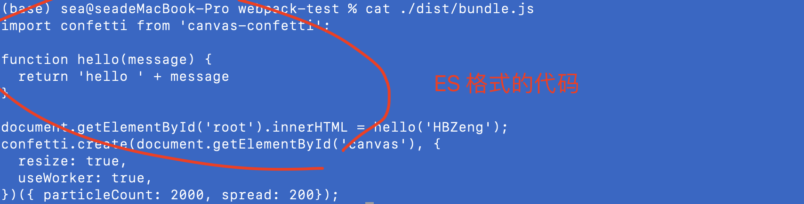
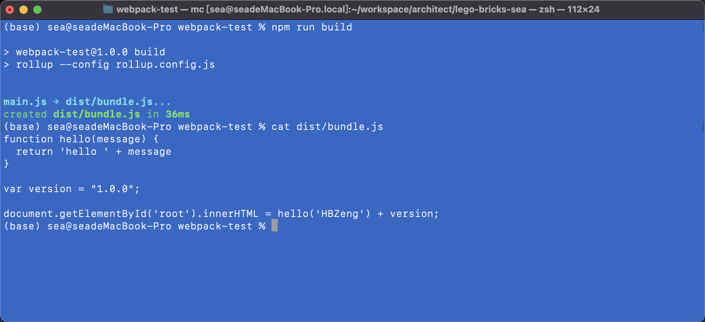

**之前用rollup在命令行打包输入了很多参数，也容易打错，为简化命令行的输入，我们可以通过配置文件进行参数配置**

```bash
npx rollup main.js --file dist/bundle.js --format iife
```

***我们可经创建一个rollup.config.js的配置文件(以后可能有更多配置参数)***

```javascript
export default {
  input: 'main.js',
  output: {
    file: 'dist/bundle.js',
    format: 'es'
  }
}
```

**此时在命行打包只需要调用这个配置文件即可**

```bash
npx rollup --config rollup.config.js
```



**Install**

```bash
npm install @rollup/plugin-json --save-dev
```

**Usage**

Create a rollup.config.js configuration file and import the plugin:

```javascript
import json from '@rollup/plugin-json';
```

**Exp:**

```javascript
import { hello } from './hello'
import { version } from './package.json'
document.getElementById('root').innerHTML = hello('HBZeng') + version

// 引生成烟花效果的插件
import confetti from 'canvas-confetti'
confetti.create(document.getElementById('canvas'), {
  resize: true,
  useWorker: true,
})({ particleCount: 2000, spread: 200});
```

修改rollup.config.js配置

```javascript
import json from '@rollup/plugin-json'
export default {
  input: 'main.js',
  output: {
    file: 'dist/bundle.js',
    format: 'es'
  },
  plugins: [ json ]
}
```

修改编译打包脚本：

```javascript
  "scripts": {
    "test": "echo \"Error: no test specified\" && exit 1",
    "build": "rollup --config rollup.config.js"
  },
```


